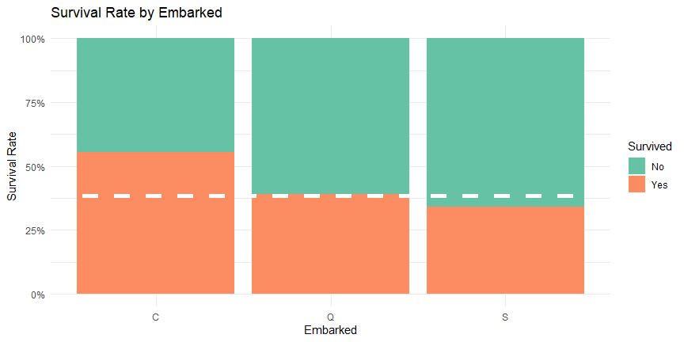

Working example on Titanic dataset
================
Terry Ding

``` r
# data wrangling
library(tidyverse)
library(forcats)
library(stringr)
library(caTools)

# data assessment/visualizations
library(DT)
library(data.table)
library(pander)
library(ggplot2)
library(scales)
library(grid)
library(gridExtra)
library(corrplot)
library(VIM) 
library(knitr)
library(vcd)
library(caret)


# model
library(glmnet) 
library(xgboost)
library(MLmetrics)
library(randomForest) 
library(rpart)
library(rpart.plot)
library(car)
library(e1071)
library(vcd)
library(ROCR)
library(pROC)
library(VIM)
```

Import data
-----------

``` r
#import data
train <- read_csv('../data/train.csv')
test  <- read_csv('../data/test.csv')

#build full set for data clean
train$input <- "train"
test$input  <- "test"
test$Survived <- NA
full <- rbind(train, test)
```

### Quick check

``` r
# check data
str(full)

# dataset dimensions
dim(full)

# Unique values per column
sapply(full, function(x) length(unique(x))) 

#Check for Missing values
sapply(full, function(x) nrow(full)-length(na.omit(x))) 
miss_pct <- 
  sapply(full, function(x) round(1-length(na.omit(x))/nrow(full),4))#missing percent
miss_pct <- miss_pct[miss_pct != 0]
data.frame(miss=miss_pct, var=names(miss_pct), row.names=NULL) %>%
          ggplot(aes(x=reorder(var, -miss), y=miss)) + 
          geom_bar(stat='identity', fill='red') +
          labs(x='', y='% missing', title='Missing percent') +
          theme(axis.text.x=element_text(angle=90, hjust=1))
```


### Feature Engineer

``` r
# Feature Engineer

#fill missing age with mean in each age group (continuous)
full <- full %>% mutate(Age = ifelse(is.na(Age), mean(full$Age, na.rm=TRUE), Age),
                        Age_group = case_when(Age < 13 ~ "Age.0012", 
                                                Age >= 13 & Age < 18 ~ "Age.1317",
                                                Age >= 18 & Age < 60 ~ "Age.1859",
                                                Age >= 60 ~ "Age.60Ov"))

#fill missing Embarked with most common value (categorical)
full$Embarked <- replace(full$Embarked, which(is.na(full$Embarked)), 'S')
```

``` r
#Name is with title, extract title for further study (feature engineer)
names <- full$Name
title <-  gsub("^.*, (.*?)\\..*$", "\\1", names)
full$title <- title
table(title)
```

    ## title
    ##         Capt          Col          Don         Dona           Dr     Jonkheer 
    ##            1            4            1            1            8            1 
    ##         Lady        Major       Master         Miss         Mlle          Mme 
    ##            1            2           61          260            2            1 
    ##           Mr          Mrs           Ms          Rev          Sir the Countess 
    ##          757          197            2            8            1            1

``` r
#merge bins with small number, rule of thumb is less than 5.
#Miss
full$title[full$title == 'Mlle'] <- 'Miss' 
full$title[full$title == 'Ms'] <- 'Miss'
full$title[full$title == 'Mme'] <- 'Mrs' 
full$title[full$title == 'Lady'] <- 'Miss'
full$title[full$title == 'Dona'] <- 'Miss'

#Officer
full$title[full$title == 'Capt'] <- 'Officer' 
full$title[full$title == 'Col'] <- 'Officer' 
full$title[full$title == 'Major'] <- 'Officer'
full$title[full$title == 'Dr'] <- 'Officer'
full$title[full$title == 'Rev'] <- 'Officer'
full$title[full$title == 'Don'] <- 'Officer'
full$title[full$title == 'Sir'] <- 'Officer'
full$title[full$title == 'the Countess'] <- 'Officer'
full$title[full$title == 'Jonkheer'] <- 'Officer'  
```

``` r
#Family size (feature engineer: create useful features by existing features)
full$FamilySize <-full$SibSp + full$Parch + 1 
full$FamilySized[full$FamilySize == 1] <- 'Single' 
full$FamilySized[full$FamilySize < 5 & full$FamilySize >= 2] <- 'Small' 
full$FamilySized[full$FamilySize >= 5] <- 'Big' 
full$FamilySized=as.factor(full$FamilySized)
```

``` r
##Engineer features based on all the passengers with the same ticket
ticket.unique <- rep(0, nrow(full))
tickets <- unique(full$Ticket)
for (i in 1:length(tickets)) {
  current.ticket <- tickets[i]
  party.indexes <- which(full$Ticket == current.ticket)
  for (k in 1:length(party.indexes)) {
    ticket.unique[party.indexes[k]] <- length(party.indexes)
  }
}

full$ticket.unique <- ticket.unique
full$ticket.size[full$ticket.unique == 1] <- 'Single'
full$ticket.size[full$ticket.unique < 5 & full$ticket.unique>= 2] <- 'Small'
full$ticket.size[full$ticket.unique >= 5]  <- 'Big'
```

``` r
#Format binary outcome
full <- full %>% mutate(Survived = case_when(Survived==1 ~ "Yes", 
                                             Survived==0 ~ "No"))

crude_summary <- full %>% filter(input=="train") %>%
                          select(PassengerId, Survived) %>%
                          group_by(Survived) %>%
                          summarise(n = n()) %>%
                          mutate(freq = round(n / sum(n),4))
crude_survrate <- crude_summary$freq[crude_summary$Survived=="Yes"]
kable(crude_summary, caption="2x2 Contingency Table on Survival.", format="markdown")
```

| Survived |    n|    freq|
|:---------|----:|-------:|
| No       |  549|  0.6162|
| Yes      |  342|  0.3838|

Exploratory data analysis
-------------------------

### Survival rate by features' groups

``` r
#EDA(Exploratory data analysis of survival rate by groups)
#By class
ggplot(full %>% filter(input=="train"), aes(Pclass, fill=Survived)) +
      geom_bar(position = "fill") +
      scale_fill_brewer(palette="Set2") +
      scale_y_continuous(labels=percent) +
      ylab("Survival Rate") +
      geom_hline(yintercept=crude_survrate, col="white", lty=2, size=2) + #overall survival rate
      ggtitle("Survival Rate by Class") + 
      theme_minimal()
```


``` r
#By sex
ggplot(full %>% filter(input=="train"), aes(Sex, fill=Survived)) +
      geom_bar(position = "fill") +
      scale_fill_brewer(palette="Set2") +
      scale_y_continuous(labels=percent) +
      ylab("Survival Rate") +
      geom_hline(yintercept=crude_survrate, col="white", lty=2, size=2) +
      ggtitle("Survival Rate by Sex") + 
      theme_minimal()
```


``` r
#By age distribution
tbl_age <- full %>%
  filter(input=="train") %>%
  select(Age, Survived) %>%
  group_by(Survived) %>%
  summarise(mean.age = mean(Age, na.rm=TRUE))

ggplot(full %>% filter(input=="train"), aes(Age, fill=Survived)) +
  geom_histogram(aes(y=..density..), alpha=0.5) +
  geom_density(alpha=.2, aes(colour=Survived)) +
  geom_vline(data=tbl_age, aes(xintercept=mean.age, colour=Survived), lty=2, size=1) +
  scale_fill_brewer(palette="Set2") +
  scale_colour_brewer(palette="Set2") +
  scale_y_continuous(labels=percent) +
  ylab("Density") +
  ggtitle("Survival Rate by Age") + 
  theme_minimal()
```


``` r
#By age group
ggplot(full %>% filter(input=="train" & !is.na(Age)), aes(Age_group, fill=Survived)) +
  geom_bar(position = "fill") +
  scale_fill_brewer(palette="Set2") +
  scale_y_continuous(labels=percent) +
  ylab("Survival Rate") +
  geom_hline(yintercept=crude_survrate, col="white", lty=2, size=2) +
  ggtitle("Survival Rate by Age Group") + 
  theme_minimal()
```


``` r
#By embarked
ggplot(full %>% filter(input=="train"), aes(Embarked, fill=Survived)) +
      geom_bar(position = "fill") +
      scale_fill_brewer(palette="Set2") +
      scale_y_continuous(labels=percent) +
      ylab("Survival Rate") +
      geom_hline(yintercept=crude_survrate, col="white", lty=2, size=2) +
      ggtitle("Survival Rate by Embarked") + 
      theme_minimal()
```



``` r
#By title
ggplot(full %>% filter(input=="train") %>% na.omit, aes(title, fill=Survived)) +
      geom_bar(position="fill") +
      scale_fill_brewer(palette="Set2") +
      scale_y_continuous(labels=percent) +
      ylab("Survival Rate") +
      geom_hline(yintercept=crude_survrate, col="white", lty=2, size=2) +
      ggtitle("Survival Rate by Title") + 
      theme_minimal() +
      theme(axis.text.x = element_text(angle = 90, hjust = 1))
```


``` r
#By family size
ggplot(full %>% filter(input=="train") %>% na.omit, aes(FamilySize, fill=Survived)) +
      geom_bar(position="fill") +
      scale_fill_brewer(palette="Set2") +
      scale_y_continuous(labels=percent) +
      ylab("Survival Rate") +
      geom_hline(yintercept=crude_survrate, col="white", lty=2, size=2) +
      ggtitle("Survival Rate by Family Group") + 
      theme_minimal() +
      theme(axis.text.x = element_text(angle = 90, hjust = 1))
```


``` r
ggplot(full %>% filter(input=="train"), aes(Pclass, fill=Survived)) +
      geom_bar(position="stack") +
      scale_fill_brewer(palette="Set2") +
      scale_y_continuous(labels=comma) +
      ylab("Passengers") +
      ggtitle("Survived by Class") + 
      theme_minimal()
```


### Survival count by features' groups

``` r
#By sex
ggplot(full %>% filter(input=="train"), aes(Sex, fill=Survived)) +
      geom_bar(position="stack") +
      scale_fill_brewer(palette="Set2") +
      scale_y_continuous(labels=percent) +
      scale_y_continuous(labels=comma) +
      ylab("Passengers") +
      ggtitle("Survived by Sex") + 
      theme_minimal()
```


``` r
#By age
ggplot(full %>% filter(input=="train"), aes(Age, fill=Survived)) +
      geom_histogram(aes(y=..count..), alpha=0.5) +
      geom_vline(data=tbl_age, aes(xintercept=mean.age, colour=Survived), lty=2, size=1) +
      scale_fill_brewer(palette="Set2") +
      scale_colour_brewer(palette="Set2") +
      scale_y_continuous(labels=comma) +
      ylab("Density") +
      ggtitle("Survived by Age") + 
      theme_minimal()
```


``` r
#By age group
ggplot(full %>% filter(input=="train" & !is.na(Age)), aes(Age_group, fill=Survived)) +
  geom_bar(position="stack") +
  scale_fill_brewer(palette="Set2") +
  scale_y_continuous(labels=comma) +
  ylab("Passengers") +
  ggtitle("Survived by Age Group") + 
  theme_minimal()
```


``` r
#By embarked
ggplot(full %>% filter(input=="train"), aes(Embarked, fill=Survived)) +
      geom_bar(position="stack") +
      scale_fill_brewer(palette="Set2") +
      scale_y_continuous(labels=comma) +
      ylab("Passengers") +
      ggtitle("Survived by Embarked") + 
      theme_minimal()
```


``` r
#By title
ggplot(full %>% filter(input=="train") %>% na.omit, aes(title, fill=Survived)) +
      geom_bar(position="stack") +
      scale_fill_brewer(palette="Set2") +
      scale_y_continuous(labels=comma) +
      ylab("Passengers") +
      ggtitle("Survived by Title") + 
      theme_minimal() +
      theme(axis.text.x = element_text(angle = 90, hjust = 1))
```


``` r
#By family size
ggplot(full %>% filter(input=="train") %>% na.omit, aes(`FamilySize`, fill=Survived)) +
      geom_bar(position="stack") +
      scale_fill_brewer(palette="Set2") +
      scale_y_continuous(labels=comma) +
      ylab("Passengers") +
      ggtitle("Survived by Family Group") + 
      theme_minimal() +
      theme(axis.text.x = element_text(angle = 90, hjust = 1))
```


Correlation Study
-----------------

``` r
#Corrplot: remove id, sib, parch
tbl_corr <- full %>%
  filter(input=="train") %>%
  select(-PassengerId, -SibSp, -Parch) %>%
  select_if(is.numeric) %>%
  cor(use="complete.obs") %>%
  corrplot.mixed(tl.cex=0.85)
```


Mosaic Plot
-----------

**Explanation**: Mosaic plot (also known as Marimekko diagrams) is a graphical method for visualizing data from two or more qualitative variables. It is the multidimensional extension of spineplots, which graphically display the same information for only one variable. [linked phrase](https://en.wikipedia.org/wiki/Mosaic_plot)

``` r
tbl_mosaic <- full %>% filter(input=="train") %>%
              select(Survived, Pclass, Sex, AgeGroup=Age_group, title, Embarked, `FamilySize`) %>%
              mutate_all(as.factor)
mosaic(~Pclass+Sex+Survived, data=tbl_mosaic, shade=TRUE, legend=TRUE)
```


Machine learning algorithm
--------------------------

``` r
###feature selection set 1, data preparation for models
feature1<-full[full$input == 'train', 
               c("Pclass", "title","Sex","Embarked","FamilySized","ticket.size")]
response <- as.factor(train$Survived)
feature1$Survived=as.factor(train$Survived)

###train validation split, 0.8/0.2
set.seed(666)
ind <- sample(1:nrow(feature1), 0.8*nrow(feature1))
train_set <- feature1[ind,]
val_set <- feature1[-ind,]
```

``` r
##Decision tree
set.seed(666)
Model_DT <- rpart(Survived~., data = train_set, method="class")
rpart.plot(Model_DT,extra = 3,fallen.leaves = T)
```


``` r
#test on validation
PRE_TDT <- predict(Model_DT, newdata = val_set, type="class")
confusionMatrix(PRE_TDT, val_set$Survived)
```

    ## Confusion Matrix and Statistics
    ## 
    ##           Reference
    ## Prediction  0  1
    ##          0 91 18
    ##          1 12 58
    ##                                          
    ##                Accuracy : 0.8324         
    ##                  95% CI : (0.7695, 0.884)
    ##     No Information Rate : 0.5754         
    ##     P-Value [Acc > NIR] : 1.798e-13      
    ##                                          
    ##                   Kappa : 0.6534         
    ##                                          
    ##  Mcnemar's Test P-Value : 0.3613         
    ##                                          
    ##             Sensitivity : 0.8835         
    ##             Specificity : 0.7632         
    ##          Pos Pred Value : 0.8349         
    ##          Neg Pred Value : 0.8286         
    ##              Prevalence : 0.5754         
    ##          Detection Rate : 0.5084         
    ##    Detection Prevalence : 0.6089         
    ##       Balanced Accuracy : 0.8233         
    ##                                          
    ##        'Positive' Class : 0              
    ## 

``` r
##Random Forest
set.seed(666)
#factorize train set to fit in random forest
temp <- as.data.frame(lapply(train_set, function(x) as.factor(x)))
rf.1 <- randomForest(x = temp[,-7],y=temp$Survived, importance = TRUE, ntree = 1000)
rf.1
```

    ## 
    ## Call:
    ##  randomForest(x = temp[, -7], y = temp$Survived, ntree = 1000,      importance = TRUE) 
    ##                Type of random forest: classification
    ##                      Number of trees: 1000
    ## No. of variables tried at each split: 2
    ## 
    ##         OOB estimate of  error rate: 15.59%
    ## Confusion matrix:
    ##     0   1 class.error
    ## 0 417  29  0.06502242
    ## 1  82 184  0.30827068

``` r
varImpPlot(rf.1)
```


``` r
###Lets Predict the test data 
val <- as.data.frame(lapply(val_set, function(x) as.factor(x)))
pr.rf <- predict(rf.1,newdata = val)

confusionMatrix(pr.rf, val$Survived)
```

    ## Confusion Matrix and Statistics
    ## 
    ##           Reference
    ## Prediction  0  1
    ##          0 93 21
    ##          1 10 55
    ##                                           
    ##                Accuracy : 0.8268          
    ##                  95% CI : (0.7633, 0.8792)
    ##     No Information Rate : 0.5754          
    ##     P-Value [Acc > NIR] : 6.47e-13        
    ##                                           
    ##                   Kappa : 0.6387          
    ##                                           
    ##  Mcnemar's Test P-Value : 0.07249         
    ##                                           
    ##             Sensitivity : 0.9029          
    ##             Specificity : 0.7237          
    ##          Pos Pred Value : 0.8158          
    ##          Neg Pred Value : 0.8462          
    ##              Prevalence : 0.5754          
    ##          Detection Rate : 0.5196          
    ##    Detection Prevalence : 0.6369          
    ##       Balanced Accuracy : 0.8133          
    ##                                           
    ##        'Positive' Class : 0               
    ## 

``` r
#Ridge/lasso regularizd regression
set.seed(666)


#cross validation glmnet, tuning alpha to get ridge or lasso
x <- data.matrix(temp[,-7])
cvfit.ridge <- cv.glmnet(x, temp$Survived, 
                    family = "binomial", 
                    alpha = 0,
                    type.measure = "class")

cvfit.lasso <- cv.glmnet(x, temp$Survived, 
                          family = "binomial", 
                          alpha = 1,
                          type.measure = "class")

par(mfrow=c(1,2))
plot(cvfit.ridge, main = "Ridge")
plot(cvfit.lasso, main = "Lasso")
```


``` r
coef(cvfit.ridge, s = "lambda.min")
```

    ## 7 x 1 sparse Matrix of class "dgCMatrix"
    ##                      1
    ## (Intercept)  2.0325610
    ## Pclass      -0.4329265
    ## title       -0.2007069
    ## Sex         -1.4227158
    ## Embarked    -0.1551834
    ## FamilySized  0.3817773
    ## ticket.size  0.3627205

``` r
# Prediction on validation set, ridge
ridge.model <- predict(cvfit.ridge, newx=data.matrix(val[,-7]), type="class")
confusionMatrix(val$Survived, as.factor(ridge.model))
```

    ## Confusion Matrix and Statistics
    ## 
    ##           Reference
    ## Prediction  0  1
    ##          0 92 11
    ##          1 32 44
    ##                                           
    ##                Accuracy : 0.7598          
    ##                  95% CI : (0.6904, 0.8204)
    ##     No Information Rate : 0.6927          
    ##     P-Value [Acc > NIR] : 0.029184        
    ##                                           
    ##                   Kappa : 0.4899          
    ##                                           
    ##  Mcnemar's Test P-Value : 0.002289        
    ##                                           
    ##             Sensitivity : 0.7419          
    ##             Specificity : 0.8000          
    ##          Pos Pred Value : 0.8932          
    ##          Neg Pred Value : 0.5789          
    ##              Prevalence : 0.6927          
    ##          Detection Rate : 0.5140          
    ##    Detection Prevalence : 0.5754          
    ##       Balanced Accuracy : 0.7710          
    ##                                           
    ##        'Positive' Class : 0               
    ## 

``` r
#lasso
lasso.model <- predict(cvfit.lasso, newx=data.matrix(val[,-7]), type="class")
confusionMatrix(val$Survived, as.factor(lasso.model))
```

    ## Confusion Matrix and Statistics
    ## 
    ##           Reference
    ## Prediction  0  1
    ##          0 91 12
    ##          1 19 57
    ##                                           
    ##                Accuracy : 0.8268          
    ##                  95% CI : (0.7633, 0.8792)
    ##     No Information Rate : 0.6145          
    ##     P-Value [Acc > NIR] : 5.834e-10       
    ##                                           
    ##                   Kappa : 0.6412          
    ##                                           
    ##  Mcnemar's Test P-Value : 0.2812          
    ##                                           
    ##             Sensitivity : 0.8273          
    ##             Specificity : 0.8261          
    ##          Pos Pred Value : 0.8835          
    ##          Neg Pred Value : 0.7500          
    ##              Prevalence : 0.6145          
    ##          Detection Rate : 0.5084          
    ##    Detection Prevalence : 0.5754          
    ##       Balanced Accuracy : 0.8267          
    ##                                           
    ##        'Positive' Class : 0               
    ## 

``` r
##support vector machine 
set.seed(666)

liner.tune <- tune.svm(Survived~.,data=temp,
                       kernel="linear",
                       cost=c(0.01,0.1,0.2,0.5,0.7,1,2,3,5,10,15,20,50,100))
liner.tune
```

    ## 
    ## Parameter tuning of 'svm':
    ## 
    ## - sampling method: 10-fold cross validation 
    ## 
    ## - best parameters:
    ##  cost
    ##   0.1
    ## 
    ## - best performance: 0.1685837

``` r
###Lets get a best.liner model  
best.linear <- liner.tune$best.model

##Predict Survival rate using test data
best.test <- predict(best.linear,newdata=val,type="class")
confusionMatrix(best.test,val$Survived)
```

    ## Confusion Matrix and Statistics
    ## 
    ##           Reference
    ## Prediction  0  1
    ##          0 91 19
    ##          1 12 57
    ##                                           
    ##                Accuracy : 0.8268          
    ##                  95% CI : (0.7633, 0.8792)
    ##     No Information Rate : 0.5754          
    ##     P-Value [Acc > NIR] : 6.47e-13        
    ##                                           
    ##                   Kappa : 0.6412          
    ##                                           
    ##  Mcnemar's Test P-Value : 0.2812          
    ##                                           
    ##             Sensitivity : 0.8835          
    ##             Specificity : 0.7500          
    ##          Pos Pred Value : 0.8273          
    ##          Neg Pred Value : 0.8261          
    ##              Prevalence : 0.5754          
    ##          Detection Rate : 0.5084          
    ##    Detection Prevalence : 0.6145          
    ##       Balanced Accuracy : 0.8167          
    ##                                           
    ##        'Positive' Class : 0               
    ## 

``` r
##XGBoost
sparse_train <- sparse.model.matrix(Survived ~ ., data = train_set)[,-1]
sparse_val <- sparse.model.matrix(Survived ~ ., data = val_set)[,-1]

dtrain <- xgb.DMatrix(data = sparse_train, label = as.numeric(train_set$Survived)-1)
dval <- xgb.DMatrix(data = sparse_val, label = as.numeric(val_set$Survived)-1)

watchlist <- list(train=dtrain, test=dval)

##XGB params
params <- list("eta"=0.01,
               "max_depth"=8,
               "colsample_bytree"=0.3528,
               "min_child_weight"=1,
               "subsample"=1,
               "objective"="binary:logistic",
               "eval_metric"="auc")

##train xgb
model_xgb <- xgb.train(params = params,
                       data = dtrain,
                       maximize = TRUE,
                       nrounds = 100,
                       watchlist = watchlist,
                       early_stopping_round = 80,
                       print_every_n=2)
```

    ## [1]  train-auc:0.821450  test-auc:0.786408 
    ## Multiple eval metrics are present. Will use test_auc for early stopping.
    ## Will train until test_auc hasn't improved in 80 rounds.
    ## 
    ## [3]  train-auc:0.853173  test-auc:0.836229 
    ## [5]  train-auc:0.851559  test-auc:0.825754 
    ## [7]  train-auc:0.855874  test-auc:0.807358 
    ## [9]  train-auc:0.858171  test-auc:0.805378 
    ## [11] train-auc:0.859646  test-auc:0.803909 
    ## [13] train-auc:0.857590  test-auc:0.800524 
    ## [15] train-auc:0.856688  test-auc:0.800779 
    ## [17] train-auc:0.857101  test-auc:0.800268 
    ## [19] train-auc:0.855314  test-auc:0.799630 
    ## [21] train-auc:0.858744  test-auc:0.805378 
    ## [23] train-auc:0.855895  test-auc:0.804228 
    ## [25] train-auc:0.855634  test-auc:0.803462 
    ## [27] train-auc:0.856561  test-auc:0.805123 
    ## [29] train-auc:0.856182  test-auc:0.801035 
    ## [31] train-auc:0.855537  test-auc:0.800396 
    ## [33] train-auc:0.857695  test-auc:0.804101 
    ## [35] train-auc:0.856894  test-auc:0.806528 
    ## [37] train-auc:0.857948  test-auc:0.809083 
    ## [39] train-auc:0.858277  test-auc:0.810233 
    ## [41] train-auc:0.858816  test-auc:0.811893 
    ## [43] train-auc:0.859128  test-auc:0.811893 
    ## [45] train-auc:0.861353  test-auc:0.815726 
    ## [47] train-auc:0.861480  test-auc:0.815342 
    ## [49] train-auc:0.861530  test-auc:0.815598 
    ## [51] train-auc:0.860367  test-auc:0.815342 
    ## [53] train-auc:0.861834  test-auc:0.815981 
    ## [55] train-auc:0.861311  test-auc:0.816109 
    ## [57] train-auc:0.860232  test-auc:0.815853 
    ## [59] train-auc:0.861758  test-auc:0.816620 
    ## [61] train-auc:0.860316  test-auc:0.815342 
    ## [63] train-auc:0.860232  test-auc:0.814704 
    ## [65] train-auc:0.861353  test-auc:0.816364 
    ## [67] train-auc:0.862921  test-auc:0.817131 
    ## [69] train-auc:0.861336  test-auc:0.815853 
    ## [71] train-auc:0.863064  test-auc:0.815470 
    ## [73] train-auc:0.863621  test-auc:0.816109 
    ## [75] train-auc:0.863309  test-auc:0.815853 
    ## [77] train-auc:0.863528  test-auc:0.817642 
    ## [79] train-auc:0.865028  test-auc:0.818025 
    ## [81] train-auc:0.863831  test-auc:0.818153 
    ## [83] train-auc:0.864101  test-auc:0.818408 
    ## Stopping. Best iteration:
    ## [4]  train-auc:0.853139  test-auc:0.840189

``` r
pred <- as.factor((predict(model_xgb, dval, type="class") > 0.5) * 1)
confusionMatrix(pred, val$Survived)
```

    ## Confusion Matrix and Statistics
    ## 
    ##           Reference
    ## Prediction  0  1
    ##          0 93 23
    ##          1 10 53
    ##                                          
    ##                Accuracy : 0.8156         
    ##                  95% CI : (0.751, 0.8696)
    ##     No Information Rate : 0.5754         
    ##     P-Value [Acc > NIR] : 7.482e-12      
    ##                                          
    ##                   Kappa : 0.614          
    ##                                          
    ##  Mcnemar's Test P-Value : 0.03671        
    ##                                          
    ##             Sensitivity : 0.9029         
    ##             Specificity : 0.6974         
    ##          Pos Pred Value : 0.8017         
    ##          Neg Pred Value : 0.8413         
    ##              Prevalence : 0.5754         
    ##          Detection Rate : 0.5196         
    ##    Detection Prevalence : 0.6480         
    ##       Balanced Accuracy : 0.8001         
    ##                                          
    ##        'Positive' Class : 0              
    ##
